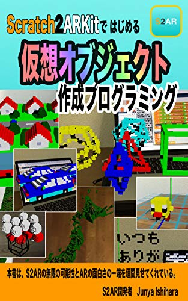
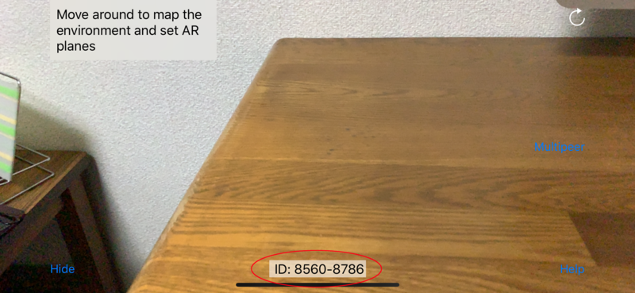
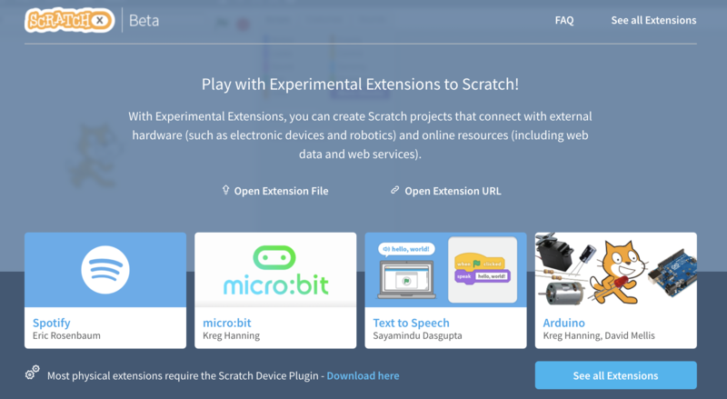
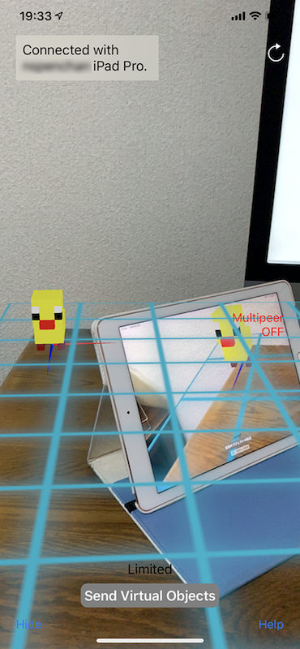
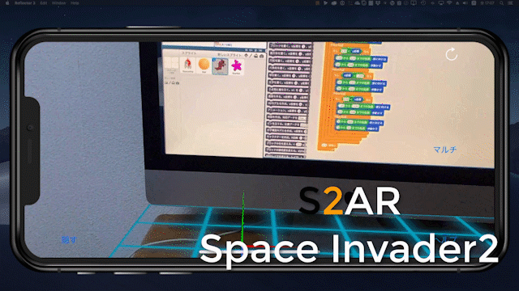
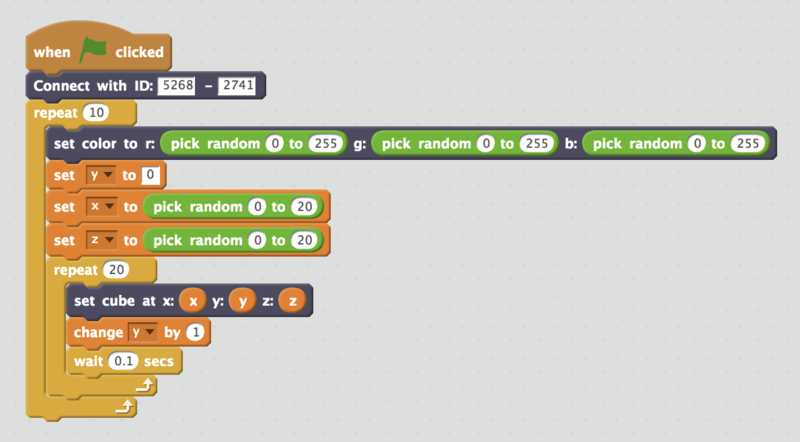

GitHub README_JA

# S2AR(Scratch2ARKit)

&raquo; [English](https://github.com/champierre/s2ar)

S2AR（Scratch2ARKit）は Scratch*（ScratchX）と ARKit を接続します。Scratch プログラミングで、拡張現実（Augmented Reality world）にブロックを積み上げて、仮想オブジェクト（Virtual Objects）を作成できます。

\* Scratch はMITメディアラボ（MIT Media Lab）のライフロング・キンダーガーデン（Lifelong Kindergarten Group）により開発されました。参照： http://scratch.mit.edu

S2AR は [App Store](https://itunes.apple.com/jp/app/s2ar/id1316847947?mt=8) より無料でダウンロードできます。

リンク

- [S2AR とは – AIに負けない！キッズ・プログラミング教室](http://creativival.com/s2ar-%E3%81%A8%E3%81%AF/)

デモ動画

- https://www.youtube.com/watch?v=lYuR27QzpL0
- https://www.youtube.com/watch?v=rBz-OfMnzKU
- https://www.youtube.com/watch?v=P9t2iPcgGGw

解説本

[Scratch2ARKitではじめる 仮想オブジェクト作成プログラミング](http://amzn.asia/d/73qpvTi)

入門編「仮想オブジェクトを設置する」で、S2AR の基本の操作を解説しています。
初級編「円錐（コーン）を作る」「空間に文字を書く」「正多面体」で、Scratch プログラミングを学習します。
中級編「自動車を作る」「ジオラマ作り」で、学んだ知識を使って複雑な形状の「仮想オブジェクト」をクラフトしていきます。
そして応用編は、S2AR と「外部のアプリケーション・サービスとの連携」です。「3Dモデリングとアニメーション」「地図を表示させる」「分子構造模型」を学びます。
本書を最後まで読み通せば、S2AR と Scratch の基礎が身につき、自由に仮想オブジェクトをクラフトできるスタートラインに立つことができます。

## 使用法（基本）

1. iOSデバイス（iPhone、iPad）で S2AR を起動します。アプリの中央下に表示される ID（接続 ID）を確認しておきます。

  

2. PC（Mac、Widows）でインターネットブラウザ（Chrome ブラウザを推奨）を開き、[ScratchX ウェブサイト](http://scratchx.org/) に接続します。

  

3. "Open Extension URL" をクリックします。入力欄に "https://champierre.github.io/s2ar/extension/s2ar.js" を入力し、"Open" をクリックします。

  

4. 警告画面が表示されます。 "I understand, continue" をクリックします。

  

5. ScratchX ウェブサイトで、S2AR拡張ブロックが使えるようになっています （カテゴリ "その他" に含まれます）。

  「ID: [ ] - [ ] で接続する」をスクリプトエリアにドラッグしてください。S2AR の接続ID を入力してからブロックをクリックすると、iOSデバイスと PC が接続され、ARプログラミングができるようになります。

  

6. iOSデバイスのカメラを動かして、ARKit に現実世界を認識させてください。青グリッド（格子）の平面が表示されたら、任意の場所をタッチして「原点」を置くことができます。原点は３次元の座標軸で表され、仮想オブジェクト（ブロック）を置く時の基準点 (0, 0, 0) になります。X軸（横方向）は赤、Y軸（上方向）は緑、Z軸（手前方向）は青で表されます。

  

7. 「ブロックを置く」をスクリプトエリアにドラッグします。クリックすると、原点の近くの座標値 (1, 0, 1) に白のブロックが現れます。座標値を変えることで、任意の場所にブロックを置くことができます。

  

  

8. 「ブロックの色を変える」で、設置するブロックの色を変えることができます。色は r, g, b の３つの整数（0 〜 255）で表されます。

  

  １６進数で色を指定するときは、こちらのブロックを使ってください。（例　赤色は ff0000）

  

  

9. 「ブロックを消す」で、ブロックを一つ削除できます。

  

  

10. 「ブロックサイズの変更」で、ブロックのサイズを変更できます。

  

  

  左から「1.0倍」「1.5倍」「2.0倍」「2.5倍」「3.0倍」「3.5倍」…

11.  「リセット」で、設置した全てのブロックを消すことができます。以上で、基本の使用法の説明を終わります。

  

## 使用法（応用）

S2AR には仮想オブジェクトの作成を助ける多くの機能が搭載されています。主要なものを説明していきます。

1. 「直方体を置く」ブロック

  原点からの座標 (x, y, z) と、幅、奥行、高さを指定します。

  

  

2. 「円柱を置く」ブロック

  原点からの座標 (x, y, z) と、円の半径、高さ、軸方向を指定します。

  

  

3. 「六角柱を置く」ブロック

  原点からの座標 (x, y, z) と、（六角形の外接）円の半径、高さ、軸方向を指定します。

  

  

4. 「球を置く」ブロック

  原点からの座標 (x, y, z) と、円の半径を指定します。

  

  

5. 「文字を書く」ブロック

  原点からの座標 (x, y, z) と、文字（英数字、ひらがな、カタカナ、漢字、記号）、軸方向を指定します。JIS 第1、第2水準の約6000文字の漢字に対応しています。

  

  

6. 「線を引く」ブロック

  始点 (x1, y1, z1) と終点 (x2, y2, z2) の間に線を引きます。

  

  

7. 「屋根を置く」ブロック

  原点からの座標 (x, y, z) と、屋根の幅、奥行、高さ、軸方向を指定します。

  

  

8. 「3Dモデルを作成」ブロック

  原点からの座標 (x, y, z) と、3Dモデルのファイル名を指定します。3Dモデルは「MagicaVoxel」で作成し、「.ply」ファイルとして書き出（Export）してください。iTunes共有機能で、３Dモデルのデータを iOSデバイスに転送すると、３Dモデルを仮想オブジェクトとして作成できます。

  

  

9. 「アニメーション」ブロック

  原点からの座標 (x, y, z) と、移動距離（diffX, diffY, diffZ）、遷移時間（time）と繰り返し回数（times）、２つ以上の3Dモデルのファイル名を指定します。

  

  

10. 「地図を作成」ブロック

  地図データのファイル名、地図の縦横のサイズ、高さ方向の拡大率、低地の色 (r1, g1, b1)、高地の色 (r2, g2, b2)、高さ方向の移動距離を指定します。

  

  

  [地形自動作成ツール](http://www.bekkoame.ne.jp/ro/kami/LandMaker/LandMaker.html)

  地形自動作成ツールの開発者　神尾正和氏

  [地形自動作成ツール](http://www.bekkoame.ne.jp/ro/kami/LandMaker/LandMaker.html)をインターネットブラウザで開きます。地形自動作成ツールで任意のサイズの地図を作成し、「csv高低データ」をダウンロードします。iTunes共有機能で、地図データを iOSデバイスに転送すると、地図を仮想オブジェクトとして作成できます。

  

  [地理院地図](https://maps.gsi.go.jp)

  出展 国土地理院ウェブサイト

  [地理院地図](https://maps.gsi.go.jp) をインターネットブラウザで開きます。作成したい地図を表示して、「機能」→「3D」→「カスタム」→「OK」から縦横「256x256」の地図を切り出します。「WebGL用ファイル」→「ダウンロード」→「標高ファイル」→「ダウンロード」から地図データをダウンロードします（地図サイズは縦横「257x257」になることに注意）。iTunes共有機能で、標高データを iOSデバイスに転送すると、地図を仮想オブジェクトとして作成できます

11. 「ピンを立てる」ブロック

  地理院地図にピンを立てることができます。ピンのデータ作成と設定値は [解説本](http://amzn.asia/d/73qpvTi) を参照してください。

  

  

  都道府県の人口推移をピンの高さで示しました。

12. 「分子構造モデルを作成」ブロック

  原点からの座標 (x, y, z) と、拡大倍率、MLDファイル名を指定します。

  

  

  [MODRAST（MOLDA）形式分子構造座標データ集](http://katakago.sakura.ne.jp/cc/mld/index.html)

  著作者 長尾 輝夫氏・木原 寛氏

  [MODRAST（MOLDA）形式分子構造座標データ集](http://katakago.sakura.ne.jp/cc/mld/index.html)をインターネットブラウザで開きます。作成したい分子構造座標データをダウンロードします。iTunes共有機能で、分子構造座標データを iOSデバイスに転送すると、分子構造模型を仮想オブジェクトとして作成できます。

13. 「ブロックの透明度を変える」ブロック

  透明度（アルファ値）を指定します。「0〜1」の小数値で表します。

  

  

  左から 0.1 ずつアルファ値を減らしました。

14. 「ARのレイヤを変える」ブロック

  

  レイヤーを「1」「2」「3」の中から選びます。レイヤーごとに仮想オブジェクトの作成や削除が行えます。

15. 「基本形状を変える」ブロック

  基本形状を「立方体（cube）」「球（sphere）」「円柱（cylinder）」「円錐（cone）」「ピラミッド（pyramid）」の中から選択できます。

  

  

  奥から「立方体（cube）」「球（sphere）」「円柱（cylinder）」「円錐（cone）」「ピラミッド（pyramid）」

16. 「基本形状の回転」ブロック

  基本形状の回転をX軸回転（rotationX）、Y軸回転（rotationY）Z軸回転（rotationZ）で指定します。単位は度（degree）を使ってください。回転の合成は、X軸回転→Y軸回転→Z軸回転の順に基本形状が回転します。

  

  

  回転角度を (rotationX, rotationY, rotationZ) で表示しました。

17. 「テクスチャを変える」ブロック

  テクスチャを変更できます。「なし（none）」「アルミ（aluminum）」「アスファルト（asphalt）」「真鍮（brass）」「レンガ（brick）」「杉（cedar）」「クラフト紙（craft）」「草（grass）」「カエデ（maple）」「マーブル１（marble01）」「マーブル２（marble02）」「パンチングメタル（punching metal）」「ステンレス（stainless steel）」「石１（stone01）」「石２（stone02）」「テラコッタ（terra cotta）」「地球（earth）」から選べます。

  

  

  左から「アルミ（aluminum）」「アスファルト（asphalt）」「真鍮（brass）」「レンガ（brick）」「杉（cedar）」「クラフト紙（craft）」「草（grass）」「カエデ（maple）」「マーブル１（marble01）」「マーブル２（marble02）」「パンチングメタル（punching metal）」「ステンレス（stainless steel）」「石１（stone01）」「石２（stone02）」「テラコッタ（terra cotta）」「なし（none）」

  

  [地球地図全球版](http://www.gsi.go.jp/kankyochiri/gm_global.html)

  出展 国土地理院ウェブサイト

  Masaya Nagaoka により「地球地図全球版 標高」の写真をリサイズ（300x300）して、JPEGに変換して使用しています。

18. 「ライティングの変更」ブロック

  ライティングの位置と強度（＝intensity）を変更できます。デフォルトのライトは消されます。

  

  

  原点の少し上にライトを移動しました。影が変化しているのが確認できます。

19. 仮想オブジェクトの共有

  Multipeer Connection で接続された iOSデバイス間で、仮想オブジェクトの共有が行えます。画面右の「マルチ（Multipeer）」ボタンを押してください。同じ Wi-Fi 回線でつながった近くの iOSデバイスと自動で接続されます。仮想オブジェクトの作成を行い、「仮想オブジェクトの転送（Send Virtual Objects）」ボタンが青に変わったらクリックしてください。受信側の原点を基準点にして仮想オブジェクトが転送されます。

  

  送信側（iPhone ）より受信側（iPad）に3Dモデルを転送できました

20. ScratchゲームをARに変換

Scratchでゲームを作り、それをS2AR内蔵モデルを使って ARに変換できます。スプライトの位置やイベント通知を利用して、ARゲームを作成できます。スプライトと同じ座標にARモデルを作成する例を示します。待つ秒数はゲームの種類によって調整してください。

モデルは１６種類。左上から
スペースシップ（spaceship）、インベーダー（invader）、人間（human）、猫（cat）、
恐竜（dinosaur）、カエル（frog）、木（tree）、車（car）、
飛行機（airplane）、剣（sword）、炎（fire）、爆発（explosion）
1x1x1、2x2x2、4x4x4、8x8x8

コスチューム b を選ぶと、スプライトの形が変わります。

## サンプルプロジェクト

